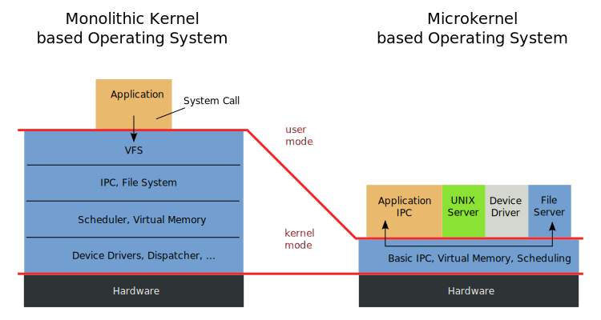

# Awesome [OS](https://en.wikipedia.org/wiki/History_of_operating_systems) [Development](https://en.wikipedia.org/wiki/List_of_operating_systems)  

    
    &nbsp;
    
    &nbsp;
    
    

## 📖 Contents
- [Kernel Type](#kernel-type)
- [Operating System for Teaching](#operating-system-for-teaching)
- [My Other Awesome Lists](#my-other-awesome-lists)
- [Contributing](#contributing)
- [Contributors](#contributors)

## Kernel Type

* Microkernel
* Monolithic Kernel
* Hybrid Kernel

## Operating System for Teaching
* [xv6](https://github.com/mit-pdos/xv6-public) - [Xv6](https://github.com/mit-pdos/xv6-riscv) is a teaching operating system developed in the summer of 2006 for MIT's operating systems course, [6.828: Operating System Engineering](https://pdos.csail.mit.edu/6.828/2024/xv6.html).

## 

### My Other Awesome Lists
You can access the my other awesome lists [here](https://cyberthreatdefence.com/my_awesome_lists)

### Contributing
[Contributions of any kind welcome, just follow the guidelines](contributing.md)!

### Contributors
[Thanks goes to these contributors](https://github.com/cybersecurity-dev/awesome-os-development/graphs/contributors)!

[🔼 Back to top](#awesome-os-development-)
